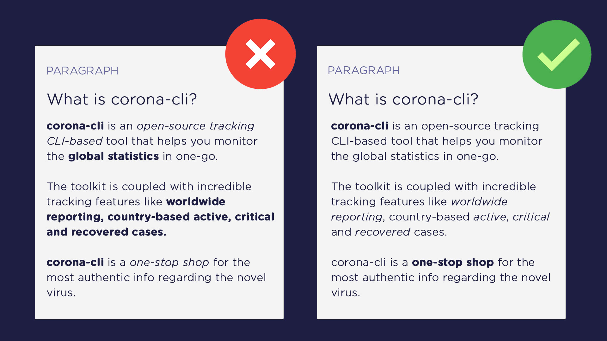

# Formatting Paragraphs

If your technical content is structured properly then, your readers can skim through it quite easily. Formatting styles like bold and italic enhance this skim through experience only if they are adopted and placed nicely.

You normally bold or italicize those parts of the content that needs emphasis or are important. By doing so, you are intimidating your readers about something you think should pique their interest.

But these formatting styles should be used wisely. An excessive use of these gives a bloated look to your content and people are forced to ignore even the necessary parts.

I generally highlight the main or related keyword/phrase as **bold** and that too only once or twice. Secondary details like features are styled as *italic*.

In addition, try not to style any external links unless it is extremely important. For an informatory notice use the light formatting styles such as italic so that it stands out from the main text.
