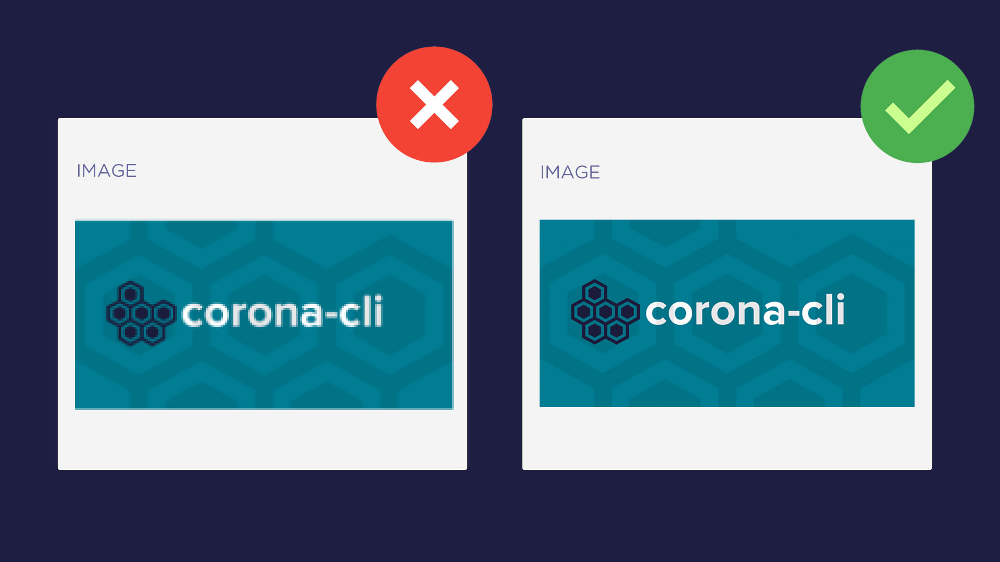

# Image Quality

Media assets like images add visual appeal to your technical content and improves interactivity. It is very crucial to take the *quality of images* into account while you're uploading them.

By quality I specifically mean that images should not be **blur**, **distorted** or **pixelated**. A bad quality image is very strenuous to eyes and if you continue viewing such images you may hurt your eyesight.

Instead, images should be in good quality and be clear enough to deliver its information.

Pixelated images are low quality that appear grainy and unclear. Generally, an image pixelates when you try enlarging a smaller one. Doing so definitely changes the size but the set image resolution stays the same. That how it becomes blur and pixelated.

To fix these, your utmost effort should be to using the images of the correct size. If you are downloading from Google make sure to choose those images whose dimensions match with your website. Otherwise, I normally use Photoshop as my picture editing software. It offers some decent blur and sharpening filters to fix pixelated images.
