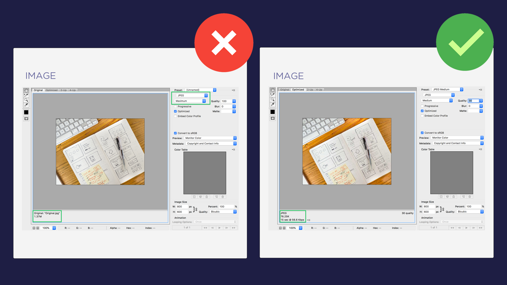

# Image Format

While writing technical content, the images should be well optimized w.r.t. to file size. An image that is **below 100 KB** is quite ideal and does not pose threat to your web resources like *bandwidth* and *site speed*.

Large-sized images take longer to load which results in slow loading web pages. There are several site optimization techniques but image optimization is #1 on my To-Do list. Tech writers think that their job is only restricted to just adding images while ignoring its file size. And they end up uploading images that are ~3 MB in size.

This is bad practice which can be prevented and fixed quite easily by following just a few steps. I use Photoshop as my image editing tool and there are a good deal of options to get small-sized fully optimized images.

One important thing, by reducing file size should not mean compromising on image quality. E.g., in Photoshop the "**Save for Web..**" option lets you save images in quality that ranges from *Low to Medium that goes to High, Very High and Maximum*.

As you choose a low-quality version, the image size decreases but chances are it may effect the quality as well. So you should be careful. If you're getting an image size for few KBs with a *High* quality option there is no need to opt for an even less quality filter.
