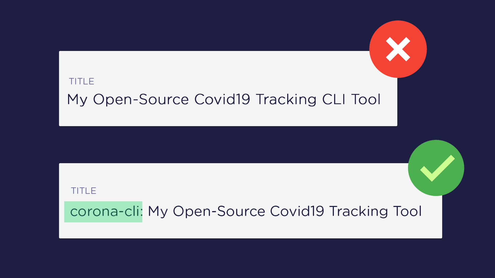

# Keywords in Title

I find content writers complaining about following all the do's and don'ts of writing and still not getting ranked on Google. Turns out that they are ignoring the most basic and important SEO practice which must be taken into account while writing post titles.

i.e., including the **target keyword** inside your title.

Post tile is one of the first interactions of your content with Google. So, it must carry all the desired components of a good SEO. Adding the target keyword inside the title speeds up the indexing process which gives better ranking position in the SERPs.

But make sure that the keyword is included only once and should not repeat. This is both a bad user experience and an SEO practice.
