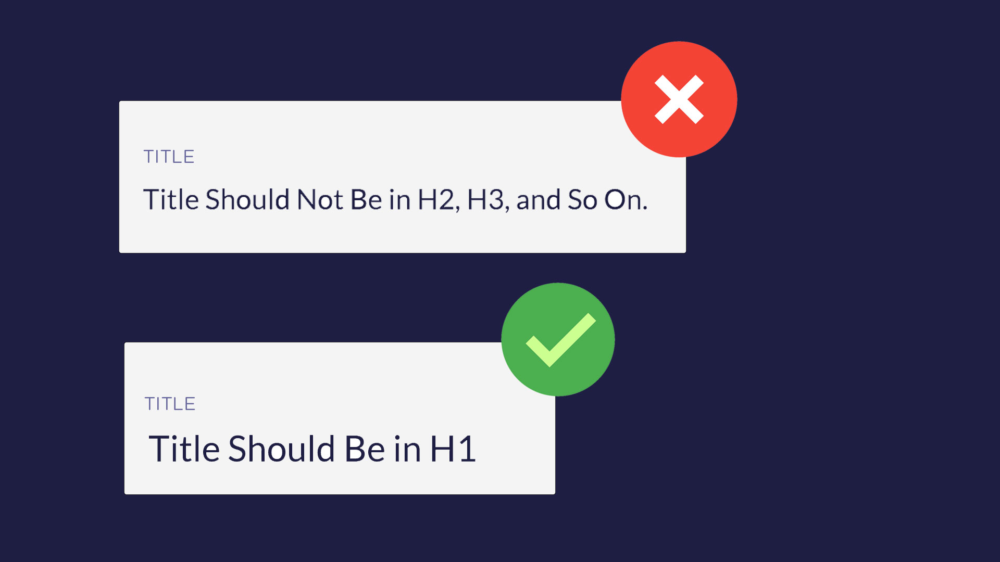

# Heading 1 (H1) in Title

A rule of thumb is that there should only be **one H1 heading** in your post and that too should be used in the title. I use one H1 heading in my entire post (inside title) and no other heading or sub-heading should use H1.

Heading tags influence the ranking of your content and H1 bears the most significance SEO-wise out of all the remaining heading tags. Titles written in H1 helps in notifying Google that this is the most important part of the post and should be indexed quickly and appropriately.

Using multiple H1 headings, confuses your readers and Google because no clear distinction can be established between the main and subtopics. As a result, you can loose a potential audience.

All good SEO assessment tools notifies you if the H1 heading is being wrongly or not used at all.
