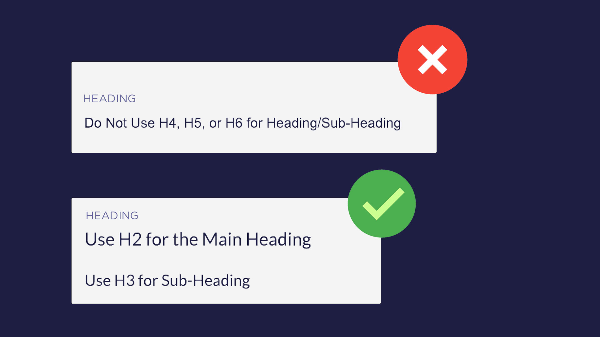

# Using Headings

There are six heading tags from Heading 1 (H1) to Heading 6 (H6) which are ordered according to their size and importance. H1 being the most important followed by the others. Having six different heading styles does not mean that you'll have to use all of these in your content.

Structuring and using headings the right way is an important part of technical content writing. We have already discussed that there should be only one H1 tag and that too should be attributed to the title of the post.

For the **main** and **sub-headings**, I'll recommend to only restrict yourself to **H2** and **H3** headings. Also, in short-length articles I find people not using headings at all. This is not a good writing practice. Precisely if your content is **300 words or plus** I would encourage you to add corresponding headings and sub-headings.

These serve as a:

- Guide for readers helping them to scan content while adding structure
- Tool to improve accessibility for visually impaired readers
- Improves SEO by limiting the bounce rate with good ranking

When to use H2 and H3 is an easy concept to learn if you consider H2 headings as the chapters of a book. Each chapter can have sections and you can use H3 to name every section.
