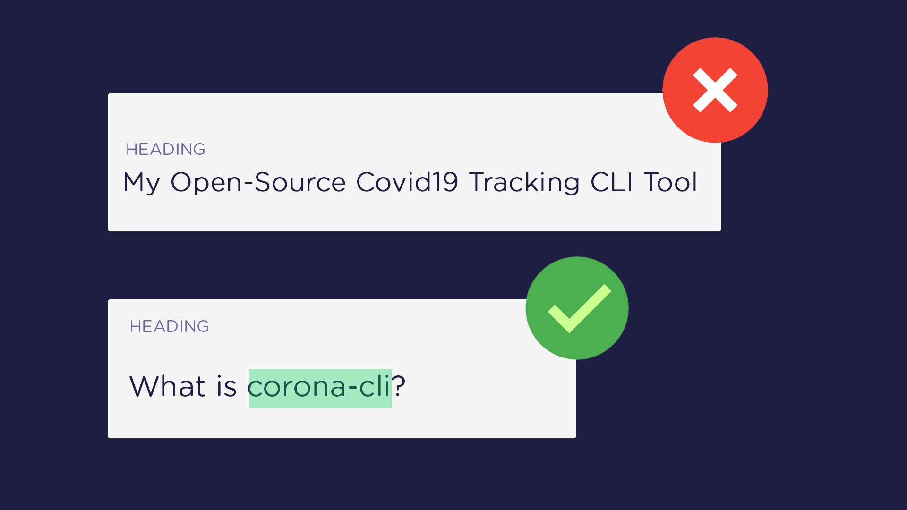

# Keywords in Headings

To consolidate your on-page SEO one step further I always add the targeted **keyword inside my post headings**. Since headings depicts the outline of an entire article, Google pays special attention to the keywords that are placed in your heading tags. Thus speeding up the indexing process that results in better rankings.

Also, avoid adding unnecessary headings/sub-headings that gives a crowded look. A good practice is to create a heading for a new section or precisely after every 200 to 250 words.

All SEO analyzing tools encourage you to add keywords in your headings. A general parameter is that the keyword should covers **approx. 30 to 75%** of your headings.

Moreover, try to make your headings *unique* and *focused* as Google prefers it. Omit any type of repeated content and make sure your heading's content is not redundant with the post title.
