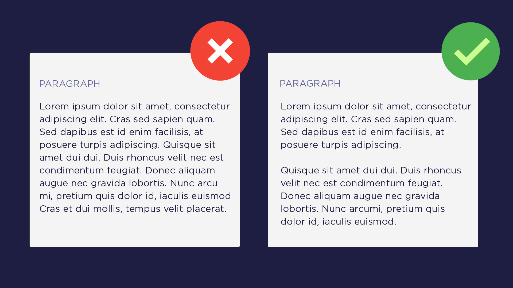

# Make Paragraphs

While writing content you should adopt the habit of making **paragraphs**. I've experienced, people ignoring this tip and write long passages of text. On average, the reader's attention span may last for about *5 minutes* and during this time a technical writer should put in every effort to make a reader stick to his content.

If you are not writing in paragraphs, the *attention span can significantly reduce* which results in getting no audience at all. Paragraphs brings a default look and feel in your content. It makes your content accessible which improves your outreach.

Moreover, readers including myself love to **skim** through the content which saves a good deal of time. No paragraphs omits this ability as well. In addition, paragraphs improves the readability of the content and helps you convey the message in an appropriate way.
