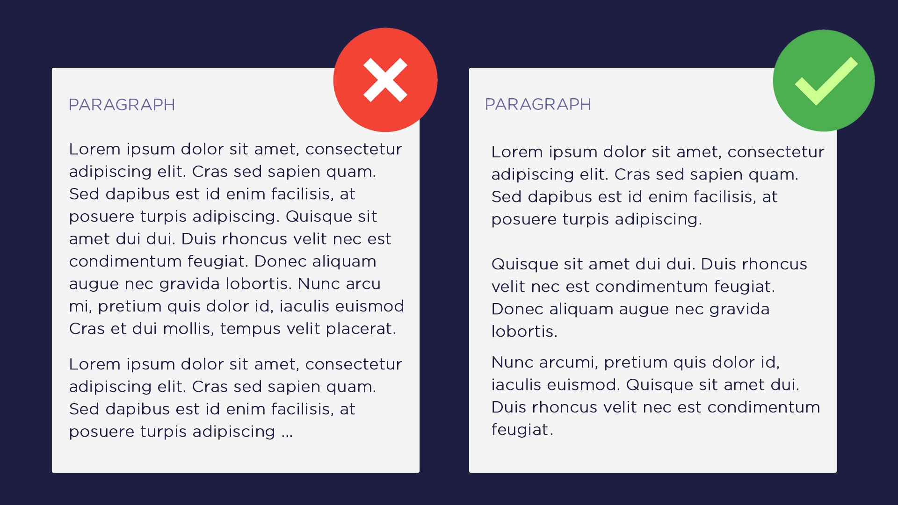

# Paragraphs Length

Now if making paragraphs is a good writing practice, then determining what length should a paragraph have is crucial as well. I do not support the idea of writing lengthy blocks of text by any means. So, it applies to a paragraph's length as well.

i.e., you must not only aim to write in paragraphs but also in **short paragraphs**. By short, I mean not more than **3 to 4 lines** and **100 to 150 words**.

Writing lengthy paragraphs kills the entire essence of making paragraphs. It brings nearly all the disadvantages of not making paragraphs at all.

Short paras, give a *precise* and *compact* look to your content. It makes it easier to read. Short paragraphs *work tremendously well* especially if you need to explain a difficult concept. Short paragraphs helps a writer win over a reader's mind psychologically.
